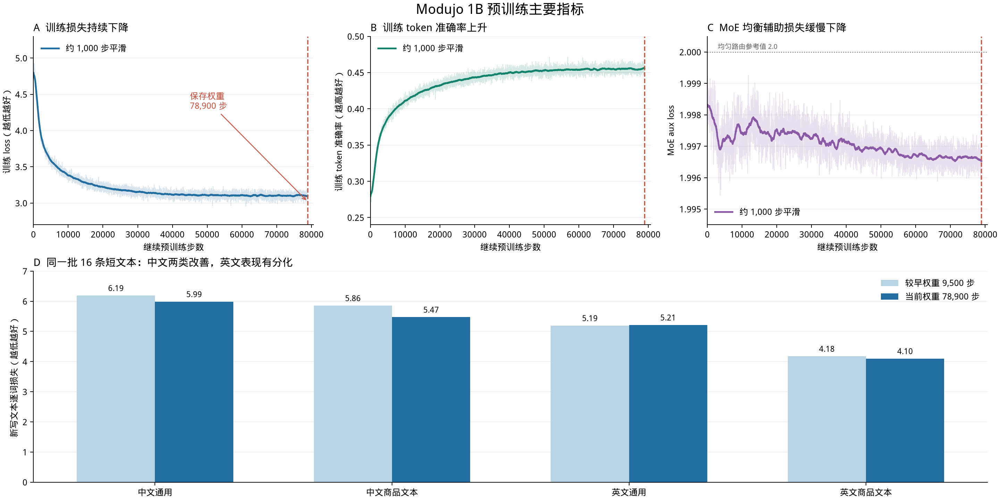

# Modujo 1B 预训练过程报告

[下载 PDF 版本](Modujo-1B-A0.75B-Pretraining-Report.pdf)

## 模型概览

本次发布的是 **Modujo-1B-A0.75B 预训练基础模型**。其中，`1B` 表示模型的总体规模，`A0.75B` 表示处理每个 token 时实际参与计算的参数规模。模型支持中英文文本续写和基础知识补全。当前版本尚未经过指令微调，更适合用于继续训练、能力评估和研究实验，不建议直接作为聊天助手使用。模型权重可从 Hugging Face 的 [`pretrain/Modujo-1B-A0.75B/`](https://huggingface.co/Alexhu1999/Modujo-9B-A1B/tree/main/pretrain/Modujo-1B-A0.75B) 获取。

| 最值得关注的数字 | 实际情况 |
|---|---|
| 训练硬件 | 后期主要使用 **4 × NVIDIA H100 80GB**；单卡训练显存约 **70–75 GiB** |
| 模型 | **1B 总规模、A0.75B 激活规模、36 层**；每层 8 个专家、每个 token 选择 2 个 |
| 数据 | 第一阶段约 **50.8 万条**长文本片段；继续训练阶段约 **1,033 万条**记录 |
| 训练时间 | 第一阶段从 **2026-09-16** 开始；继续训练从 **09-17** 开始，主要大批次训练在 **09-21 至 09-27**；最后一次长续跑日志记录约 **5 天 9 小时** |
| 实际训练长度 | 最长 **2,048 token/条**；模型配置的 32K 位置上限不代表这轮已训练验证了 32K 效果 |

## 训练路线：为什么分两段

**第一段是通用预训练。**模型在中英文文本上学习句子结构、常见知识和基本续写。训练集整理成约 **50.8 万条**、每条接近 2,048 token 的片段。训练日志里，loss 从第 1 步的约 **12.46** 降到第 18,000 步的约 **4.53**。最终产物的后续训练链从这个约 18,000 步的权重出发；另有继续训练到 19,300 步的通用权重，但它**不是**最终权重的直接前身。

**第二段是继续预训练。**训练混合了 MiniMind 文本，以及 Amazon ESCI、Wayfair WANDS 的商品资料。后两者主要提供标题、品牌、描述和属性等原始文本；它们是这轮语料的组成部分，并非模型用途的唯一目标。经数据处理后，训练载入约 **1,033 万条**记录，平均约 **211 token/条**；按记录数和平均长度估算，整轮数据约 **21.8 亿 token**。训练到 78,900 步，对应计划一轮的约 **97.8%**。这是数据规模估算，并非去重后的独立 token 数。

这条训练链在 9 月中下旬有多次续跑。最新权重于 **2026-09-27 23:16（UTC+8，文件时间）**保存；最后的训练日志还到 78,940 步，但没有更晚的完整模型权重。因此评估和后续转换都应明确指向 **78,900 步权重**，不要把日志步数当成产物步数。

## 硬件和结构：哪些选择影响了这次训练

后期大批次阶段使用 **4 张 H100 80GB**，BF16 精度。每卡每次输入 4 条，累积 8 次梯度后更新一次，实际全局 batch 为 **128 条/步**。每条最多 2,048 token；因为原始记录长短差异很大，**128 × 2,048 只是每步的长度上限，不是实际处理的 token 数**。最后一段续跑平均约 **6.7 秒/步**，单卡显存日志约 **70–75 GiB**。

模型采用 **36 层混合专家结构（MoE）**，总规模为 **1B**，每个 token 的激活规模约为 **A0.75B**。每层有 8 个专家，每个 token 只选 2 个专家；注意力层按“**3 层 GDN 线性注意力 + 1 层常规注意力**”重复排列。当前权重**尚未加入 QSA 稀疏索引器**；名称中的 `qwen_sparse_attention` 层在这一阶段按常规注意力模式运行。

训练还加入了 **MoE 专家负载均衡辅助损失（aux loss）**，系数为 **0.001**。它持续约束路由器，避免大量 token 长期集中到少数专家。aux loss 从早期约 **1.998** 缓慢降至后期约 **1.996–1.997**，说明模型持续优化这一均衡目标；单看这个汇总值，还不能证明每个专家的负载都完全均匀。

这轮实际采用 **2,048 token 训练长度**，重点仍是学习文本的统计规律。它不能据此证明长上下文能力，也不能让模型自动掌握稳定的问答和指令遵循：这些能力需要单独的数据与评估。

## 主要指标：训练进展与实际效果

上图 **A、B** 来自继续预训练日志：loss 由约 4.7 降至约 3.1，token 准确率由约 28% 升至约 45%。**C** 是 MoE 的 aux loss，缓慢下降，反映专家均衡目标仍在被优化。浅线是原始记录，深线按约 1,000 步平滑；红色虚线标出已保存的 78,900 步权重。这些都是**训练指标**，不能当作独立测试成绩。第一阶段的 loss 约 4.53，因数据分布不同，不与这里的 3.1 直接比较。

**D** 用同一批 16 条新写短文本对比训练早期和最终发布权重。这里的逐词损失越低越好：中文通用 **6.19 → 5.99**、中文商品文本 **5.86 → 5.47**、英文商品文本 **4.18 → 4.10**；英文通用 **5.19 → 5.21**，没有改善。可以看到**中文两类都有进步，英文表现有分化**。这组样本太小，只能作为快速检查，不能作为正式泛化结论。

### 生成案例：局部能力已有，长输出仍不稳

下面案例均来自 78,900 步权重的固定提示词测试，最多生成 64 个 token。除标注“采样”的一例外，都使用贪心解码。表中摘录关键片段；完整输出见文末记录。

| Good case | 输入 | 实际输出摘录 | 说明 |
|---|---|---|---|
| 中文事实 | `中国的首都是` | `哪里？中国的首都是北京。` | 事实正确，但接成了问答，而非直接补全。 |
| 简单算术 | `问：1加1等于多少？\n答：` | `加1等于2。` | 给出正确答案；后面又自行转到质数话题。 |
| 英文常识 | `The sun rises in the east and` | ` sets in the west.` | 首句补全正确；继续生成开始重复。 |
| 日常续写（采样） | `今天天气很好，我决定` | `去公园散步。我决定去公园散步。公园里有许多美景……` | 开头连贯，与语境相关。 |

| Bad case | 输入 | 实际输出摘录 | 问题 |
|---|---|---|---|
| 日常续写 | `今天天气很好，我决定` | `我去了公园，看到了很多美丽的花朵和树木。` 连续重复多次 | 开头合理，但无法维持段落质量。 |
| 简单解释 | `植物需要阳光，是因为` | `植物需要阳光才能生长，因此它们需要阳光才能生长。` | 循环改写问题，没有解释光合作用。 |
| 商品文本 | `这款无线耳机支持蓝牙连接……产品特点：` | `无线连接支持蓝牙连接，支持蓝牙连接，支持蓝牙连接。` | 反复复述，缺少新信息。 |
| 聊天指令 | `你好，请用中文介绍一下自己。` | `A:\n\|\n\|\n\|\n\|……` | 使用聊天模板后没有回答，陷入表格符号。 |
| 身份问答 | `问：你好，你是谁？\n答：` | `我是来自阿里云的超大规模语言模型，我叫通义千问。` | 冒认其他模型身份。 |

这些案例说明模型具备**短距离的文本续写和部分知识补全能力**，但很难稳定地维持整段回答。可能原因是预训练主要让模型预测下一个词，学到的文本模式未必等于按用户需求回答。贪心解码可能放大重复，身份冒认可能来自训练文本中的问答模式迁移。这些都是基于现象的推测，尚未做消融确认。

## 下一步重点

接下来计划沿三个方向分别验证，所有实验都从当前预训练基础模型出发，并使用独立目录保存，避免不同训练路线相互混淆。

### SFT：提升指令理解和回答质量

使用高质量中英文指令数据进行监督微调，让模型从“续写文本”进一步转向“理解要求并完成任务”。评估重点包括指令遵循、回答完整性、重复控制、事实准确性和多轮对话稳定性。

### QSA：探索更高效的长上下文处理

为常规注意力层加入 QSA 稀疏索引器，先单独训练索引能力，再进行联合训练。实验将同时比较长文本任务效果、推理速度和显存占用，确认效率提升是否会带来明显的质量损失。

### Looped Transformer：探索层复用

让部分 Transformer 层在一次前向计算中重复使用，以较少的独立参数获得更深的计算过程。实验将与普通模型对照，重点观察训练稳定性、生成质量、计算开销，以及参数复用是否带来实际收益。
